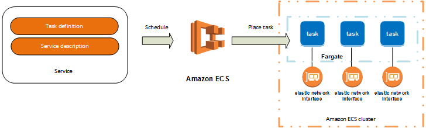

# Introduction into Amazon Web Services (AWS)

All icons and images are owned by AWS.

## Todos

- [ ] Describe who is the audience of this document
- [ ] Sort services

## Table of Contents

- [Introduction](#introduction)
- [Regions](#regions)
- [S3](#s3-simple-storage-service-)
- [SQS](#sqs-simple-queue-service-)
- [SNS](#sns-simple-notification-service-)
- [Kinesis](#kinesis-data-streams-)
- [RDS](#rds-relational-database-service-)
- [🚧 DynamoDB](#dynamodb-)
- [EC2](#ec2-elastic-compute-cloud-)
- [ASG](#asg-auto-scaling-group-)
- [ECS](#ecs-elastic-container-service-)
- [VPC](#vpc-virtual-private-cloud-)
- [Parameter Store](#systems-manager-parameter-store-)
- [ElastiCache](#elasticache-)
- [Route 53](#route-53-)
- [ELB](#elb-elastic-load-balancing-)
- [Lambda](#lambda-)
- [CloudFront](#cloudfront-)
- [IAM](#iam-identity-and-access-management-)
- [🚧 WAF](#waf-)
- [ARN](#arn-amazon-resource-names)
- [Certification](#certification)
- [Links](#links)

## Introduction

- Dominant cloud computing provider
- Founded 2002, first cloud service (S3) in 2006
- Annual revenue in 2020: $46 billion
  - Fun fact:  
    Amazon annual revenue 2020: $280 billion, EBIT $23 billion (including AWS)  
    AWS EBIT was $13.5 billion (that is 58%❗️)  
    *[source: Amazon report 2020, p25 and p26](https://s2.q4cdn.com/299287126/files/doc_financials/2021/ar/Amazon-2020-Annual-Report.pdf)*
- AWS owns around ~32% off the cloud market, its competitors are Microsoft Azure (18%) and Google Cloud (9%)

## [Regions](https://aws.amazon.com/about-aws/global-infrastructure/regions_az)

Worldwide:  


EMEA (Europe Middle East Africa):  


- Global Infrastructure
- Region = Location
- Region consists of multiple `AZs` (Availability Zones)
- Near us (Germany): 
  
  Code | Name / City | Country | Since
  --- | --- | :--- | :---:
  `eu-central-1` | Frankfurt | 🇩🇪 Germany | 2014
  `eu-west-1` | Ireland | 🇮🇪 Ireland | 2007
  `eu-west-2` | London | 🇬🇧 UK | 2016
  `eu-west-3` | Paris | 🇫🇷 France | 2017
  `eu-south-1` | Milan | 🇮🇹 Italy | 2020
  `eu-north-1` | Stockholm | 🇸🇪 Sweden | 2018
  `eu-east-1` | ? | 🇪🇸 Spain | Upcoming (2022/2023)

- AZs are physically separated from each other
  - Connected via low latency links
  - Marked by a letter behind region code
    - eg.: `eu-central-1[a,b,c]`
    - Warning: `eu-central-1a` is not an unique identifier (depends on the account) [read more](https://docs.aws.amazon.com/ram/latest/userguide/working-with-az-ids.html)
  - Traffic within one `AZ` is free (rule of thumb)

## [S3 (Simple Storage Service)](https://aws.amazon.com/s3/) 

- Cloud block storage
- Arbitrary number of files, each up to 5TB per file
- `99.999999999%` (11 9s) durability (= 10 million objects saved over 10,000 years -> expectation: 1 is lost)
- `99.9%` availability SLA (but designed for `99.99%`) in `Standard`
- Different storage classes
  - `Standard` - Low latency and high throughput
  - `Intelligent Tiering` - Automatically optimizes storage costs (depending on access pattern)  
    
  - `Standard-IA` (IA = Infrequent-Access) - Same as Standard but less availability 
  - `One Zone-IA` - Only one AZ -> less availability
  - `Glacier` - Very cheap; retrieval time at least a few minutes
  - `Glacier Deep Archive` - cheapest option, at least 12 hours retrieval time
  - Dictates the [price](https://aws.amazon.com/s3/pricing/)
    - Standard = `$0.0245/GB`
    - Glacier Deep Archive = `$0.0018/GB` (92,65% less)
- S3 only knows of keys, eg. when you store `path/to/a/file` this (=`path/to/a/file`) is also the key, but the S3 management UI shows `path`, `to` and `a` as a directory
- Versioning, Encryption, Lifecycle Management, Events


## [SQS (Simple Queue Service)](https://aws.amazon.com/sqs/) 

- Decouples systems, messages have to be pulled
- Two types
  - `Standard`: 3,000 messages / sec, at least once (occasionally more than one time), best effort ordering
  - `FiFo`: 300 messages / sec, exactly once, **f**irst **i**n **f**irst **o**ut
- Visibility timeout while processing (after message pull) (max. 12 hours)
- Batching of messages possible, max payload `256KB`
- Max. message retention 14 days
- `DLQ` (Dead Letter Queue): unprocessable messages are automatically moved

## [SNS (Simple Notification Service)](https://aws.amazon.com/sns/) 

- Pub / Sub (Topics)
- Standard, FiFo
- Filtering, Fanout  
  
- Push to
  - Lambda
  - SQS
  - Kinesis
  - HTTP
  - Email
  - SMS
- In comparison to SQS this is push (whereas SQS is pull)


## [Kinesis (Data Streams)](https://aws.amazon.com/kinesis/data-streams) 

- Kinesis Video Streams, **Kinesis Data Streams**, Kinesis Data Firehose, Kinesis Data Analytics
- Real time (within 70ms)
- Multiple producer, multiple consumer
- Shard is base throughput unit (`1MB/s` write, `2MB/s` read)
- Every event has a partition key (is used for routing onto a shard; usually user ID)


## [RDS (Relational Database Service)](https://aws.amazon.com/rds/) 

- Different engines available
  - MySQL
  - MariaDB
  - Oracle
  - Microsoft SQL Server
  - PostgreSQL
  - Aurora
    - MySQL or PostgreSQL **compatible** (it's a fork)
    - Serverless (‘can sleep’), automatic scaling
- Read replicas (performance)
- Multi-AZ deployments (availability, durability)
- Automated backups, snapshots
- Maintenance window (applying backups and stuff, downtime possible)

## [DynamoDB](https://aws.amazon.com/dynamodb/) 

🚧 **TODO**

## [EC2 (Elastic Compute Cloud)](https://aws.amazon.com/ec2/) 

- Many `AMI` (Amazon Machine Image) available
- Different Instance types
  - General Purposes
  - Compute Optimized
  - Memory Optimized
  - Accelerated Computing (GPU)
  - Storage Optimized
  - [Nice EC2 instance type overview](https://instances.vantage.sh/) (former ec2instances.info)
  - Max is `U-24TB1 Metal`: `448` vCPU, `24576GB` RAM
- Storage options
  - Instance Storage - fastest
  - [`EBS` (Elastic Block Storage)](https://aws.amazon.com/ebs/) - can only be attached to one instance
  - [`EFS` (Elastic File System)](https://aws.amazon.com/efs/) - can be shared by multiple instances
- [Hibernation](https://docs.aws.amazon.com/AWSEC2/latest/UserGuide/Hibernate.html) - write RAM into EBS and start from that again  
  
- [Spot Instances](https://aws.amazon.com/ec2/spot/) - spare capacity, can be terminated within 2 minute notice (save up to 90% off On-Demand price)
- [Saving Plans](https://aws.amazon.com/savingsplans/) - commitment on a certain $/hour usage for 1 or 3 years (all, partial or no upfront payment) (save up to 72%)  
  
- Reserved Instances - commitment on a certain instance type or family (save up to 72%)

## [ASG (Auto Scaling Group)](https://aws.amazon.com/autoscaling/) 

- Minimum, desired and maximum capacity
- Will ensure the desired capacity at all time
- Three different scaling strategies: manual, dynamic, scheduled
- Manual scheduling
  - Keep desired capacity all the time
- Dynamic scheduling
  - Target tracking scaling: maintain a certain value of a metric (and increase or decrease desired capacity based on that metric)
  - Step scaling: increase or decrease desired capacity based on a set of scaling adjustments
  - Simple scaling: increase or decreased desired capacity on a single scaling adjustment

Example of scaling based on a custom metric in connection with SQS:


## [ECS (Elastic Container Service)](https://aws.amazon.com/ecs/) 

- Can run on `EC2` or `Fargate` (serverless)
- `ECS` consists of clusters
  - Cluster contains Services
  - Service contains Tasks (=Instances) (Kubernetes: Pod)
  - Task contains Containers  
  
- Deployment ensures availability (you can set a minimum of healthy tasks in percent)
- Failed tasks are automatically replaced  
  


### [ECR (Elastic Container Registry)](https://aws.amazon.com/ecr/) 

Can be used to store and provide Docker Images

### [EKS (Elastic Kubernetes Service)](https://aws.amazon.com/eks/) 

Managed Kubernetes Service


## [VPC (Virtual Private Cloud)](https://aws.amazon.com/vpc/) 

- Every VPC has its own IP address space
- `Subnet` a segment of a VPC IP address space
  - Instances in a private subnet do not have a public IP address
  - Instances in a public subnet do have a public IP address
- `Internet Gateway` access to the public Internet (and access from the Internet)
- `NAT Gateway` access to the internet from private subnets (NAT = Network Address Translation)
- `Virtual private gateway` endpoint for a VPN connection
- `Peering Connection` allows communication between two peered VPCs (not transitive)
- `VPC Endpoint` private connection to other services
- `Egress-only Internet Gateway` egress only access for IPv6 traffic (like NAT for IPv4)

Example of a VPC with an Internet Gateway:  


VPN connection between AWS and a corporate network is possible:  


PrivateLink can be used to access another AWS service without using public internet: (PrivateLink uses VPC Endpoint)  


Flow within a network, passing through SG, NACL, ...  


### [SG (Security Group)](https://docs.aws.amazon.com/vpc/latest/userguide/VPC_SecurityGroups.html)

- ALl traffic is denied by default (unless allowed by a rule)
- A rule can only allow traffic and not deny it
- `SGs` are stateful
  - When a rule allows outgoing traffic, the response is allowed too regardless of the incoming rules
  - When a rule allows incoming traffic, the response is allowed too regardless of the outgoing rules
- Instances within the same security group can't communicate with each other (unless allowed by a rule)
- A source for a rule can be:
  - a security group
  - IPv4 CIDR block or a single IPv4
  - IPv6 CIDR block or a single IPv6
  - or a prefix list ID
- You can specify the protocol (TCP, UDP, IDMP), and a port range for a rule


### [NACL (Network Access Control List)](https://docs.aws.amazon.com/vpc/latest/userguide/vpc-network-acls.html)

- A rule can (in contrast to a SG) deny traffic
- A rule has a number
  - Evaluation of rules start with the lowest number
  - Evaluation stops as soon as a rule matches traffic

## [Systems Manager (Parameter Store)](https://aws.amazon.com/systems-manager/) 

- Key Value store
- Typically used for storing passwords, configuration etc.
- Datatypes: `String`, `StringList`, `SecureString`
- `SecureString` uses KMS (Key Management Service) to encrypt value
- Can be automatically retrieved by EC2, ECS, Lambda, ...

Overview:  


## [ElastiCache](https://aws.amazon.com/elasticache/) 

- Redis or Memcached
- Maintenance window for applying patches
- Parameter group to define engine configuration values
- Cluster, Read Replica, Multi-AZ

## [Route 53](https://aws.amazon.com/route53/) 

- DNS Service
- Different routing policies
  - `Simple`: standard DNS
  - `Weighted`: portion of traffic to each resource
  - `Geolocation`: depending on location
  - `Latency`: depending on latency
  - `Failover`: when health check fails, failover to next
  - `Multivalue`: chooses randomly one value
- Private DNS within VPC
- Alias records as own feature (like CNAME)

## [ELB (Elastic Load Balancing)](https://aws.amazon.com/elasticloadbalancing/) 

- Different types
  - `ALB` (Application Load Balancer)
    - Layer 7 (Application)
    - HTTP, HTTPS, gRPC
    - Target types: IP, Instance, Lambda
    - Header based routing, redirect
    - "Standard"
  - `NLB` (Network Load Balancer)
    - Layer 4 (Transport)
    - TCP, UDP, TLS
    - Target types: IP, Instance
    - Used for extreme performance / low latency
  - `GWLB` (Gateway Load Balancer)
    - Layer 3 (Network)
    - IP
  - `CLB` (Classic Load Balancer)
    - *old, shouldn't be used for new projects*
    - previously known as ELB (before introduction of ALB)
- Health checks for targets

## [Lambda](https://aws.amazon.com/lambda/) 

- Runs code without provisioning or managing servers, pay only for the time your code runs
- Supports different languages (`Java`, `Go`, `PowerShell`, `Node.js`, `C#,` `Python`, and `Ruby`)
- Can be triggered by different services (e.g. ELB, S3 Event, ...)
- Maximal runtime is 15 minutes
- Define the needed memory (between 128 MB and 10,240 MB) - the compute power is scaled accordingly (1,769 MB = 1 vCPU)
- (Beware cold starts) *improved significantly*
- Failed events can be sent into a `DLQ` (Dead Letter Queue)

## [CloudFront](https://aws.amazon.com/cloudfront/) 

- `CDN` (Content Delivery Network)
- Improves latency by hosting at different PoPs (Point of Presence) (AWS name: Edge Location)
  
- Can work with S3, EC2, ELB or any HTTP origin
  - Therefore, it can serve static and dynamic content
- Routing can be customized with `Behavior`

Example of CloudFront serving a file from S3 as origin:  


Example of dynamic and static serving with CloudFront:  


## [IAM (Identity and Access Management)](https://aws.amazon.com/iam/) 

- Users, groups and roles
  - Users = people or services (can have credentials)
  - Groups = container for users (can belong to another group)
  - Roles = services
- Policies are permissions to do something
  - can be attached to users, groups and roles
  - Use Policy Simulator to check and validate effects of policies
- Roles can be assumed  
  
- Federation of users with some kind of directory possible  
  
- Permissions hierarchy:
  1. Explicit deny
  2. Explicit allow
  3. Implicit deny

### Policy

Example Policy:

```json
{
  "Version": "2012-10-17",
  "Id": "some-unique-id",
  "Statement": {
    "Sid": "1",
    "Effect": "Allow",
    "Principal": { "AWS": "arn:aws:iam::123456789012:user/dirk" },
    "Action": [
      "s3:PutObject",
      "s3:Get*"
    ],
    "Resource": "arn:aws:s3:::my-bucket/*",
    "Condition": {
      "DateGreaterThan": {
        "aws:CurrentTime": "2021-12-02T13:37:42Z"
      }
    }
  }
}
```

- [`Version`](https://docs.aws.amazon.com/IAM/latest/UserGuide/reference_policies_elements_version.html) - defines language syntax (two valid values `2012-10-17`, `2008-10-17`)
- [`Id`](https://docs.aws.amazon.com/IAM/latest/UserGuide/reference_policies_elements_id.html) - identifier for policy, used by different services
- [`Sid`](https://docs.aws.amazon.com/IAM/latest/UserGuide/reference_policies_elements_sid.html) - short for `statement ID`, identifier for statement
- [`Effect`](https://docs.aws.amazon.com/IAM/latest/UserGuide/reference_policies_elements_effect.html) - does this statement allow or deny something? (two valid values `Allow`, `Deny`)
- [`Principal`](https://docs.aws.amazon.com/IAM/latest/UserGuide/reference_policies_elements_principal.html) - specifies a principal that is allowed or denied access to a resource (when not attached to a user, group or role)
  - whole AWS account: `"Principal": { "AWS": "arn:aws:iam::123456789012:root" }`
  - a specific user: `"Principal": { "AWS": "arn:aws:iam::AWS-account-ID:user/user-name" }`
  - an IAM role: `"Principal": { "AWS": "arn:aws:iam::AWS-account-ID:role/role-name" }`
  - an assumed-role: `"Principal": { "AWS": "arn:aws:sts::AWS-account-ID:assumed-role/role-name/role-session-name" }`
  - an AWS service: `"Principal": { "Service" : [ "ecs.amazonaws.com" ] }`
  - every one: `"Principal": "*"`
  - *there are options for federated web identities and users*
- [`Action`](https://docs.aws.amazon.com/IAM/latest/UserGuide/reference_policies_elements_action.html) - which actions are allowed or denied (e.g. `sqs:SendMessage`, `s3:PutObject`)
- [`Resource`](https://docs.aws.amazon.com/IAM/latest/UserGuide/reference_policies_elements_resource.html) - to which resources this policy applies
- [`Condition`](https://docs.aws.amazon.com/IAM/latest/UserGuide/reference_policies_elements_condition.html) - additional conditions which must be true for the policy to be applied
- *there are also [`NotPrincipal`](https://docs.aws.amazon.com/IAM/latest/UserGuide/reference_policies_elements_notprincipal.html), [`NotAction`](https://docs.aws.amazon.com/IAM/latest/UserGuide/reference_policies_elements_notaction.html) and [`NotResource`](https://docs.aws.amazon.com/IAM/latest/UserGuide/reference_policies_elements_notresource.html) but be cautious with them*


## [WAF](https://aws.amazon.com/waf/) 

🚧 **TODO**

## [ARN (Amazon Resource Names)](https://docs.aws.amazon.com/general/latest/gr/aws-arns-and-namespaces.html)

General formats:

```
arn:partition:service:region:account-id:resource-id
arn:partition:service:region:account-id:resource-type/resource-id
arn:partition:service:region:account-id:resource-type:resource-id
```

- `partition` either:
  - `aws` 'Standard'
  - `aws-cn` China Regions
  - `aws-us-gov` GovCloud Regions
- `service` an AWS service (e.g. `s3`)
- `region` the region (e.g. `eu-central-1`)
- `account-id` ID of the AWS account
- `resource-id` ID of the resource

*Mind that the specific ARN depends on the resource!*

## [Certification](https://aws.amazon.com/certification)


For example `Cloud Practitioner`:

- 65 questions in English (or Indonesian, Japanese, Korean or Simplified Chinese)
- 90 minutes
- Price $100

Recommendation: Udemy course from [`Stephane Maarek`](https://www.udemy.com/user/stephane-maarek/) is a good starting point

## Links

- [AWS Glossary](https://docs.aws.amazon.com/general/latest/gr/glos-chap.html)
- [AWS Blog](https://aws.amazon.com/blogs/)
- [awesome AWS list](https://github.com/donnemartin/awesome-aws)
- [Open Guide to Amazon Web Services](https://github.com/open-guides/og-aws)
- [acloudguru.com Blog](https://acloudguru.com/blog)
- [Flashcards for learning](https://cloudbite.attejuvonen.fi)
